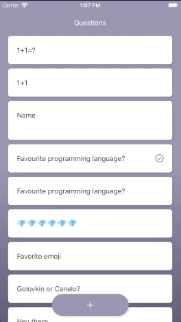
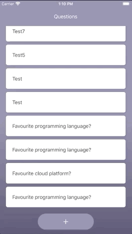
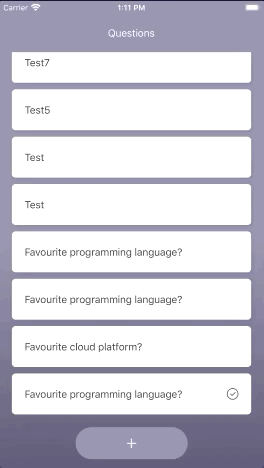

# Polls app

This is an application that lets users vote through the public [Polls API](https://pollsapi.docs.apiary.io/).

The project uses:

- [React Native](https://facebook.github.io/react-native/docs/getting-started) for iOS & Android app development
- [TypeScript](https://www.typescriptlang.org/docs/home.html) for type-safety
- [Redux](https://redux.js.org/api/api-reference) for state management
- [Sagas](https://redux-saga.js.org/) for managing side effects
- [React Native Testing Library](https://callstack.github.io/react-native-testing-library/) for testing the components

The aim of this project is to be used as a reference on how to:

- test and structure a `React Native` + `Redux` project
- use `TypeScript` and `Redux-Saga` in a `React Native` + `Redux` project

## Supported features

| Pagination                         |           Voting           |             Creating questions |
| ---------------------------------- | :------------------------: | -----------------------------: |
|  |  |  |

## Structure of the project

The folder structure of the project looks as follows:

```
src
└── assets
└── components
└── navigation
└── screens
└── services
├── store
│ └── sagas
│ ├── selectors
│ └── slices
└── styles
└── test
└── types
└── App.tsx
```

### assets

Contains images used in the project. Other shared assets should be stored here (e.g. fonts, videos, etc.).

### components

Contains reusable UI components.

### navigation

Contains navigation related files (`Navigators`, `NavBar`, etc.).

### screens

Contains screens of the app. Each screen has dedicated folders for components and hooks.

### services

Contains `APIClient` and `APIHelpers`. Other services should be stored here (e.g. localization, error tracking, etc.).

### store

- sagas: `Sagas` used for side effects of `Redux actions`
- selectors: `Selectors` to retrieve and compute derived data from the `Redux state`
- slices: `Slices` of the `Redux state` which contain `actions` and `reducers`

### styles

Contains colors and other style values (icon sizes, spacings, etc.) used throughout the app.

### test

Contains test related files (jest setup, mocks, etc.).

### types

Contains the types used throughout the project.

---

### NOTE

For bigger projects I'd recommend creating separate folders for each feature. That way it's easier to navigate the project. Also, several developers can work on different features without having to worry too much about merge conflicts.

Example:

```
src
└── assets
└── components
└── navigation
└── services
├── features
│ └── login
│ | └── components
│ | ├── screens
│ | └── store
│ └── questions
│ | └── components
│ | ├── screens
│ | └── store
└── styles
└── test
└── types
└── App.tsx
```

Please, keep in mind that there are many other ways in which you can structure a `React Native` project. This is the approach that has worked for me. Feel free to adopt it either partially or fully and see if it fits your needs.

---

## Running

Install dependencies:

```
yarn

cd ios && pod install
```

Start packager:

```
yarn start
```

### iOS:

Run the app:

```
yarn ios
```

If you prefer Xcode rather than command line:

- open `./ios/PollsApp.xcworkspace` in Xcode
- select a simulator or a device
- hit the Run button

### Android:

Have an Android emulator running (quickest way to get started), or a device connected

Run the app:

```
yarn android
```
